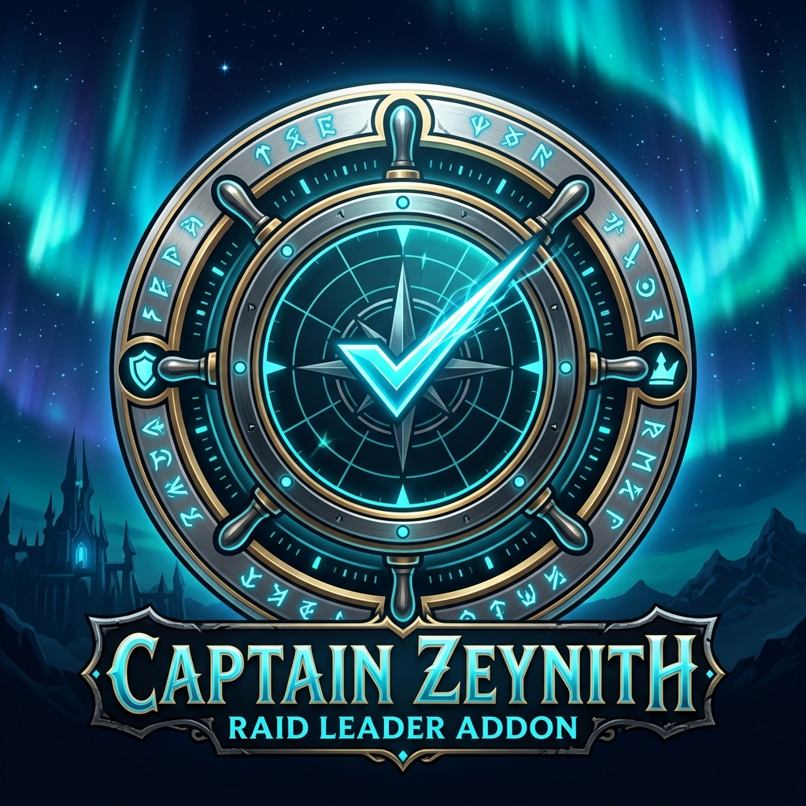

  

# Northern Sky Raid Tools — Captain Zeynith

**NSRT - Captain Zeynith** is a World of Warcraft (Retail) raid utility addon designed for Raid Leaders, Officers, and Guild Masters. It provides automated and on-demand version checking for required raid addons (such as *WowUtils*, *NorthernSkyRaidTools*, *BigWigs*, *RCLootCouncil*, or any custom addon you add).

Results are presented in an elegant, interactive popup report styled after **NorthernSkyRaidTools (NSRT)**, with one-click raid announcement capabilities.

---

## ✨ Features

- ⚡ **Ultra-Fast Reactive Scanner (~2s)**: Unlike traditional version checkers that wait for long fixed timeouts, Captain Zeynith dynamically advances to the next addon as soon as active raid members reply. A full 4-addon scan completes in ~1.5 to 2.5 seconds!
- 📊 **Interactive Report Window**: Clean, standalone popup matching NSRT's dark & cyan aesthetics.
  - **Smart Sorting**: Players with missing or outdated addons are automatically sorted to the top.
  - **Class Colors**: Player names are highlighted with their respective class colors.
  - **Per-Addon Columns**: Real-time status indicators (green checkmark for up-to-date, red for outdated or missing, yellow for disabled).
  - **Summary Badges**: Quick overview count of up-to-date members, outdated members, and missing responses.
- 📢 **One-Click Raid Broadcast**: Announce only the players who need to update directly to `/raid` or `/p` from the report window or via chat command.
- 🎯 **AtrocityEssentials (AES) Integration**: Seamlessly injects a dedicated `Check Addons` button directly into the *Raid Control* dropdown panel (if AES is installed).
- ⚙️ **Integrated NSRT Settings Tab**: Fully configured directly inside NorthernSkyRaidTools' UI (`/nsrt` -> `Captain Zeynith` tab or `/cz`). Add/remove any addon to track dynamically.

---

## 📦 Dependencies

| Addon | Status | Description |
| :--- | :--- | :--- |
| **NorthernSkyRaidTools (NSRT)** | **Required** | Provides the network communication protocol and options UI foundation. |
| **atrocityEssentials (AES)** | *Optional* | Adds a dedicated `Check Addons` quick button inside the Raid Control dropdown. |

---

## 🚀 Usage & Slash Commands

| Command | Description |
| :--- | :--- |
| `/cz` (or `/zeynith`) | Open the configuration tab inside NorthernSkyRaidTools |
| `/cz report` (or `/cz table`) | Open/re-open the interactive results table of the latest scan |
| `/cz check` | Trigger an immediate scan across the raid and open the report |
| `/cz announce` | Broadcast the latest report issues to Raid/Party chat |
| `/cz list` | Display currently tracked addons and your local version |
| `/cz add <AddonFolder>` | Add a new addon folder to track (e.g. `/cz add Details`) |
| `/cz remove <AddonFolder>` | Remove an addon folder from tracking |
| `/cz toggle` | Toggle automatic check on Ready Checks |

---

## 🛠️ Installation

### Manual Installation
1. Download the latest release `.zip` from GitHub Releases.
2. Extract the `NSRT_CaptainZeynith` folder into your WoW AddOns directory:
   `World of Warcraft\_retail_\Interface\AddOns\`
3. Ensure **NorthernSkyRaidTools** is also installed and enabled.
4. Restart WoW or run `/reload`.

---

## 📄 License

This project is licensed under the MIT License - see the [LICENSE](LICENSE) file for details.
